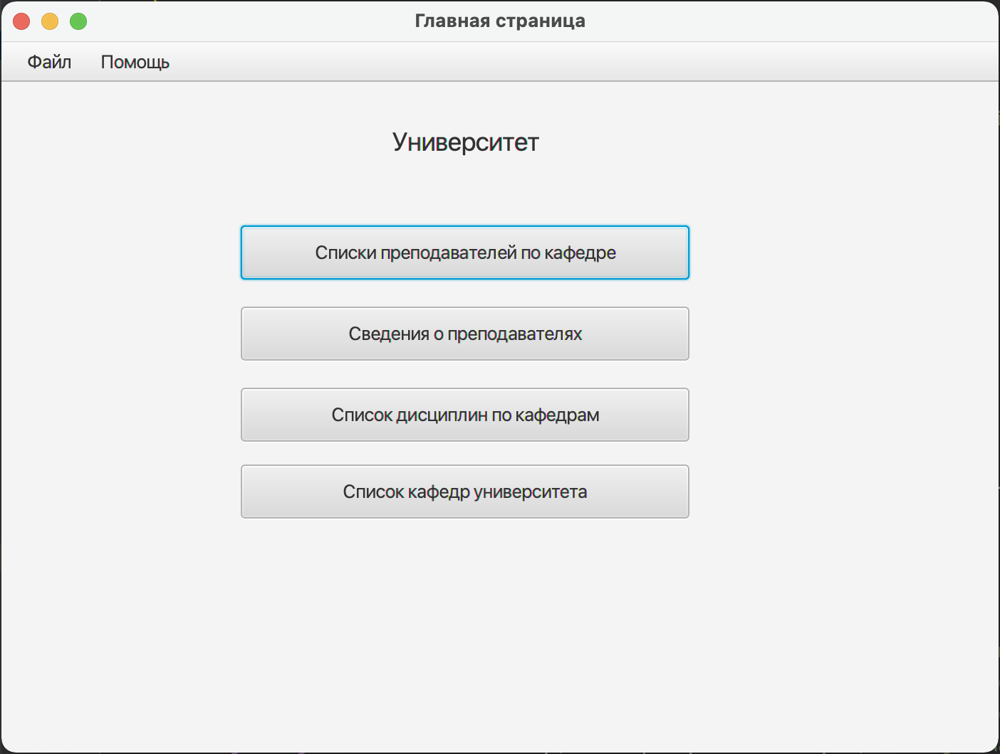
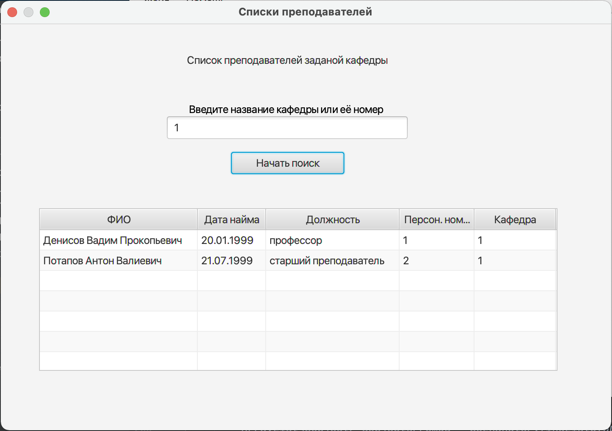
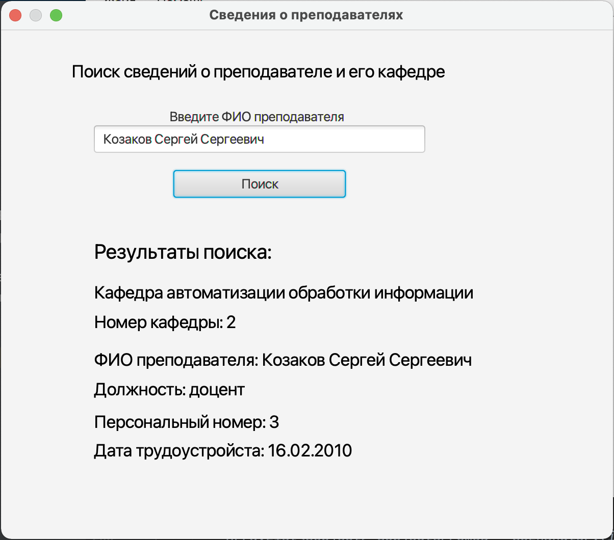
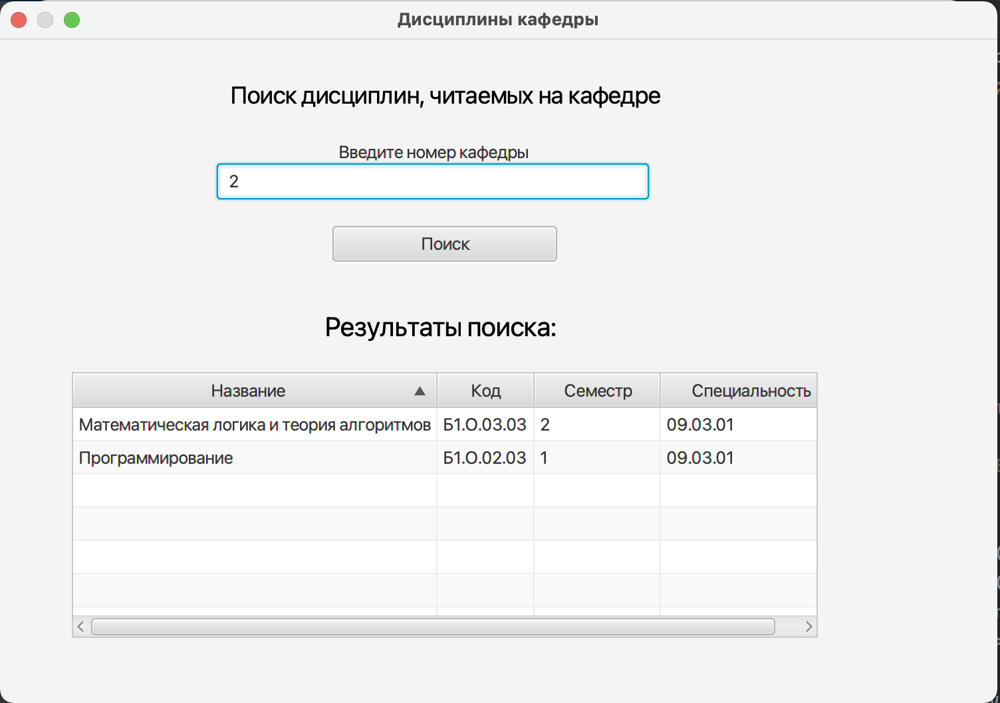
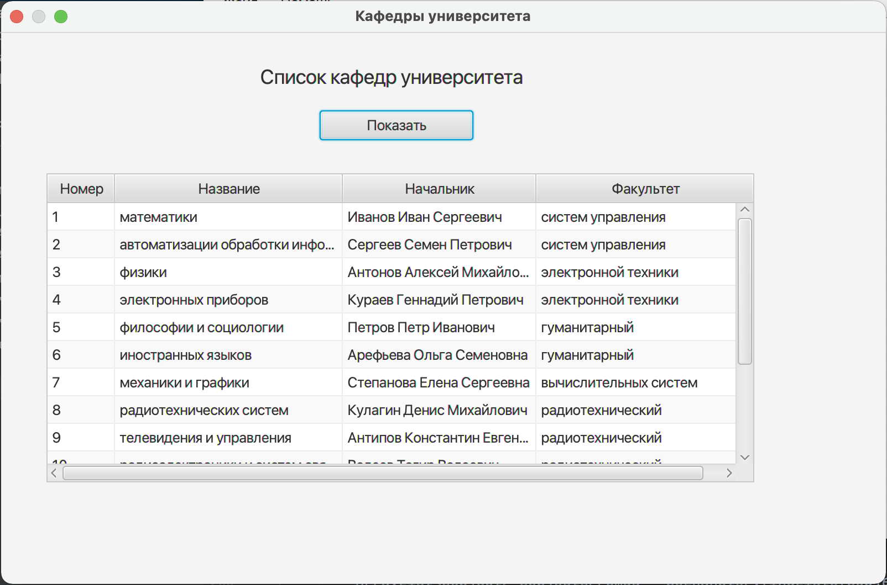
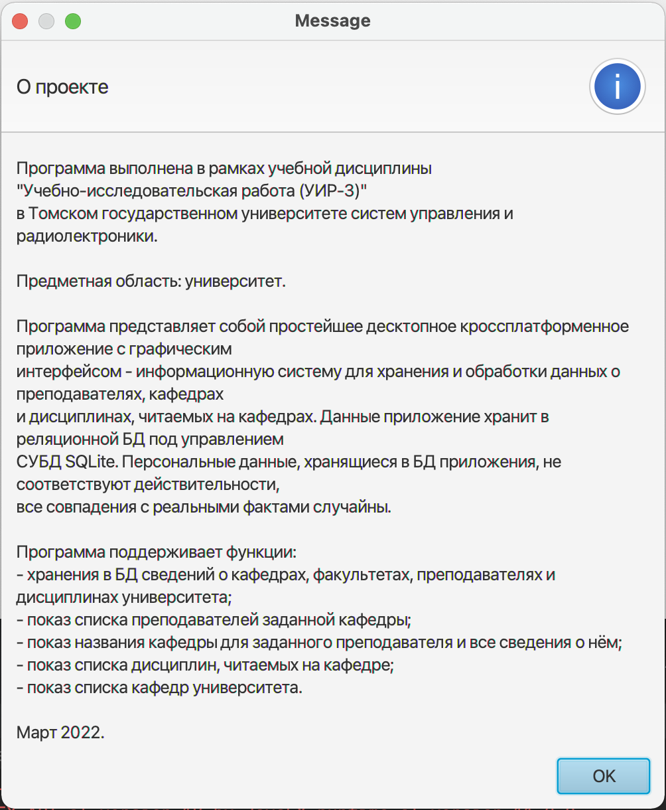

# This is my little study project at [TUSUR](https://tusur.ru/en)
The application saves and returned some information about education process at an university
Used technologies: Java 11 + JavaFX 11 + SQLite

The application have four fuction:

0. Main window

First funtion shows list of teachers by department

Second funtion shows all info about teacher by its full name

Third funtion shows us all subjects which department have

Fourth funtion shows list Of department at an university

'About us' - information about app in Russian

